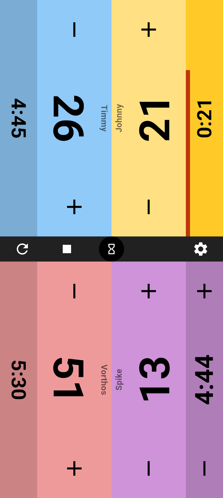
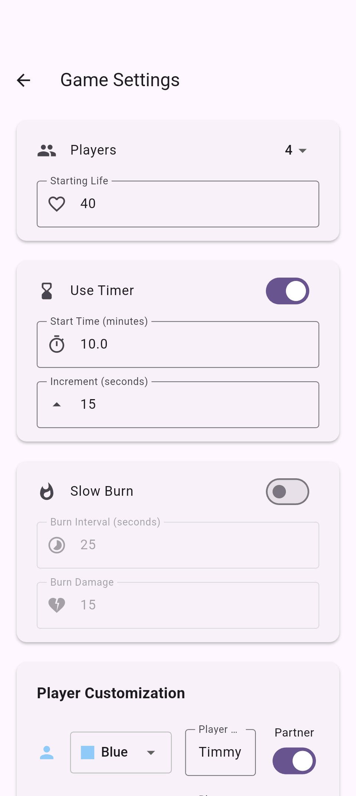
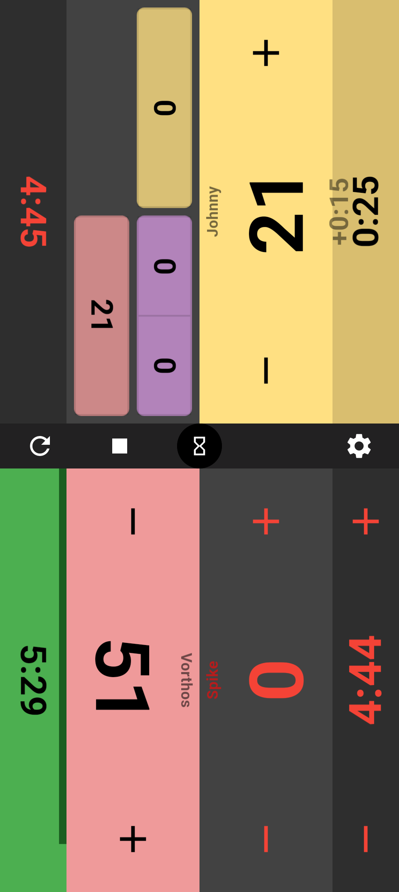

# ROPE

Are you tired of your opponents taking 3 business days to resolve their turns? 

Or maybe you just want to play Bullet ~~Chess~~ Magic?

**ROPE** (The **R**apid **O**ptimizer of **P**ace within **E**DH and adjacent formats) is a simple MTG life counter with a built-in chess clock, designed for EDH. Keep your games moving, track your damage, and penalize slow play.

<div align="center">
  
  
  
</div>

---

## Features

| Feature | Description |
| :--- | :--- |
| **Chess Clock** | An optional in chess clock featuring adjustable increments, a player is out of the game if they run out of time. |
| **Slow Burn** | An optional feature which punishes the slowest players for taking too long turns by pinging them for a set amount of HP when the "rope" burns out. |
| **Life Tracking** | Just like any MTG life counter you can tap to adjust life by 1, or hold to add/subtract 10. |
| **Commander Damage** | Swipe vertically on a players life total to add commander damage. You can long press to reveal +/- controls. |

---


## Getting Started

### Prerequisites

To run this project locally or build it for your device, you will need the Flutter SDK and Android Studio.

**Arch Linux Installation:**
```bash
sudo pacman -S flutter-bin
sudo pacman -S android-studio
```

*Note: Make sure to install the Android Command-Line Tools via the SDK manager in Android Studio.*

### Running The Software 

To run the app locally:

```bash
flutter clean
flutter pub get
flutter run
```

### Building the APK

To generate a standalone APK for Android devices:

```bash
flutter build apk
```

```bash
flutter pub get
flutter pub run flutter_launcher_icons
```

---

## Development


**Run these commands before opening a Pull Request:**

```bash
# Format all Dart files
dart format .

# Check for linting errors
flutter analyze

# Run unit tests
flutter test
```


If you've got any suggestions feel free to open an Issue or make a PR.
